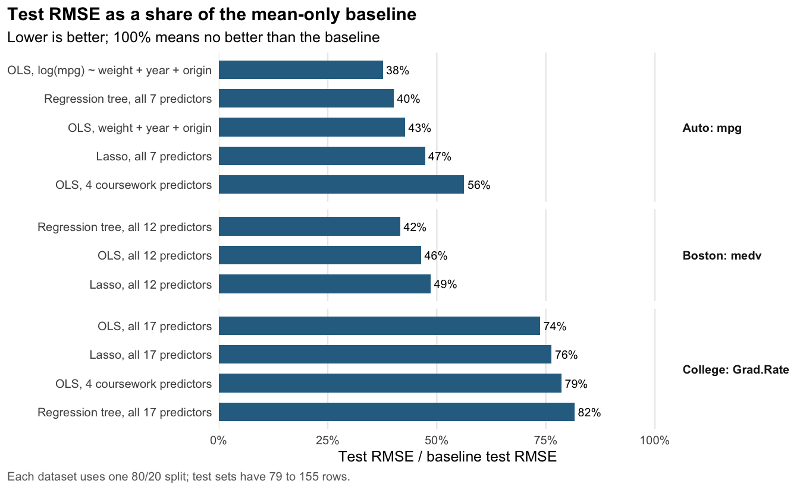
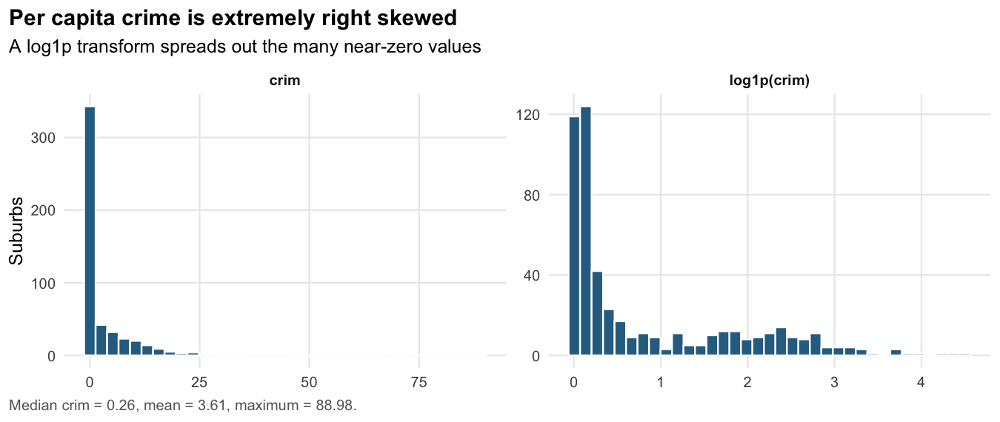
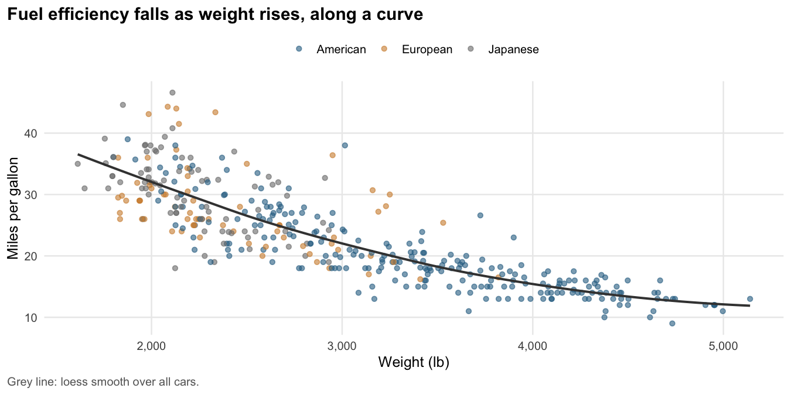

# Regression Analysis of the College, Auto and Boston Datasets

A reproducible R analysis that compares linear, lasso and tree models on three classic statistics datasets, with a held-out test set, a mean-only baseline, residual diagnostics, automated tests and CI.

[](https://github.com/VijaysinghPuwar/CS601C-Computational-Statistics-Project/actions/workflows/report.yml)

## Live report

**[Open the full report](https://vijaysinghpuwar.github.io/CS601C-Computational-Statistics-Project/)** (rendered from `analysis/report.Rmd` by GitHub Actions on every push to `main`).

## Overview

The project asks three questions of three public datasets from *An Introduction to Statistical Learning* (ISLR):

| Dataset | Question | Response |
|---|---|---|
| College (777 U.S. colleges, 1995) | Which institutional characteristics are associated with graduation rate? | `Grad.Rate` |
| Auto (392 cars, 1970 to 1982) | Which vehicle characteristics are associated with fuel efficiency, and how does collinearity affect the model? | `mpg` |
| Boston (506 suburbs, 1970 census) | Which neighborhood characteristics are associated with crime and with median home value? | `crim`, `medv` |

Each predictive model is fitted on an 80% training split, compared with 10-fold cross-validation on that split, and scored once on the remaining 20% against a baseline that always predicts the training mean. The data are observational, so the results describe association, not causation.

It started as a midterm project for CS601C Computational Statistics at Pace University (Spring 2025) and was later reworked with proper model evaluation, diagnostics, data validation and reproducible builds.

## Key findings

- **Fuel efficiency is well predicted by a small model.** `log(mpg) ~ weight + year + origin` reached a test RMSE of 3.04 mpg against 8.09 mpg for the baseline (test R squared 0.86), better than the original four-predictor coursework model (4.55 mpg). Displacement, cylinders, weight and horsepower are strongly collinear (VIF up to 19.3), so their separate coefficients are unreliable.
- **Boston home values show nonlinearity.** A pruned regression tree had a test RMSE of 3.94 (in $1000s) against 4.39 for linear regression and 9.47 for the baseline, and the linear model's residuals curve at both ends of the fitted range.
- **Crime needs a log scale.** Per capita crime is extremely right skewed. Modeling `log1p(crim)` raised the Shapiro-Wilk W of the residuals from 0.51 to 0.91. On that scale, property tax rate and lower-status population share are strongly associated with crime, while bounding the Charles River is not (p = 0.51).
- **Graduation rate is only partly explained.** The best College model reached a test R squared of 0.46, so most of the variation is not captured by these institutional variables.
- **Data checks found two impossible values.** Two colleges report percentages above 100 (`Grad.Rate` = 118, `PhD` = 103). They are excluded from modeling in code; the raw CSV is unchanged.

## Model results

Test metrics come from one held-out split per dataset (79 to 155 test rows), so small differences between models are within sampling noise. The report has the full comparison, including lasso and tree models for every dataset.

| Dataset | Model | CV RMSE | Test RMSE | Test MAE | Test R² |
|---|---|---|---|---|---|
| Auto (`mpg`) | Mean baseline | 7.73 | 8.09 | 6.69 | -0.02 |
| Auto (`mpg`) | OLS, 4 coursework predictors | 4.20 | 4.55 | 3.54 | 0.68 |
| Auto (`mpg`) | OLS, log(mpg) ~ weight + year + origin | 3.03 | 3.04 | 2.26 | 0.86 |
| Boston (`medv`) | Mean baseline | 9.14 | 9.47 | 6.85 | 0.00 |
| Boston (`medv`) | OLS, all 12 predictors | 5.10 | 4.39 | 3.44 | 0.78 |
| Boston (`medv`) | Regression tree, all 12 predictors | 4.71 | 3.94 | 2.63 | 0.83 |
| College (`Grad.Rate`) | Mean baseline | 17.19 | 16.66 | 13.66 | 0.00 |
| College (`Grad.Rate`) | OLS, 4 coursework predictors | 13.51 | 13.09 | 10.26 | 0.38 |
| College (`Grad.Rate`) | OLS, all 17 predictors | 13.07 | 12.28 | 9.30 | 0.46 |

RMSE and MAE are in the units of the response (mpg, $1000s, percentage points). CV RMSE is 10-fold cross-validation on the training set only. Test R squared is `1 - SSE/SST` on the test set.

## Visualizations







## Methods and skills

- **R:** base R, `ggplot2`, `glmnet` (lasso), `rpart` (regression trees), R Markdown
- **Statistics:** multiple linear regression, response transformations (`log`, `log1p`), variance inflation factors, residual diagnostics (residuals vs fitted, normal Q-Q, scale-location, Cook's distance)
- **Model evaluation:** train/test split, k-fold cross-validation with shared folds, nested tuning for lasso and tree models, mean baseline, RMSE, MAE, out-of-sample R squared
- **Engineering:** input validation, unit tests with `testthat`, pinned dependencies with `renv`, GitHub Actions CI, GitHub Pages deployment

## Repository structure

```
.
├── analysis/report.Rmd       # the report (narrative, tables, figures)
├── R/
│   ├── helpers.R             # loading, validation, metrics, fitters, plotting
│   └── analysis.R            # run_analysis(): the whole pipeline in one call
├── data/                     # raw CSVs, never modified
├── assets/                   # README figures, regenerated by render.R
├── tests/
│   ├── run-tests.R           # test entry point
│   └── testthat/             # unit and pipeline tests
├── render.R                  # renders the report to _site/index.html
├── renv.lock                 # pinned package versions
└── .github/workflows/report.yml
```

## Run locally

Requirements: R 4.5 or later and [pandoc](https://pandoc.org/installing.html) (bundled with RStudio).

```sh
git clone https://github.com/VijaysinghPuwar/CS601C-Computational-Statistics-Project.git
cd CS601C-Computational-Statistics-Project

# Install the pinned package versions into a project library.
# renv bootstraps itself the first time R starts in this folder.
Rscript -e "renv::restore()"

Rscript tests/run-tests.R   # unit and pipeline tests
Rscript render.R            # writes _site/index.html and refreshes assets/
```

Run the commands from the project root. In RStudio, open the folder as a project, run `renv::restore()` once, then knit `analysis/report.Rmd`.

## Reproducibility

- The raw data in `data/` are read as-is; every cleaning step is in code and documented in the report.
- The train/test split, cross-validation folds and model tuning use fixed seeds (set in `R/analysis.R`), so repeated renders produce identical numbers. A test checks this.
- `renv.lock` pins R and package versions. CI restores them on a clean Ubuntu runner, runs the tests and renders the report.
- The report stops rendering if a sentence that describes a result in words no longer matches the computed values, and a test checks that the numbers in this README match the analysis.

## Limitations

- Observational data: no causal conclusions.
- One train/test split with small test sets; the CV column is the more stable comparison.
- The datasets are decades old and are standard teaching data, not current measurements.
- Boston `medv` is capped at 50 in the source data.
- The model search is deliberately small (linear, lasso, single tree) to keep the comparison interpretable.

## Data sources

- College, Auto and Boston datasets from the `ISLR2` R package accompanying James, Witten, Hastie and Tibshirani, *An Introduction to Statistical Learning*, 2nd edition.
- `data/Boston.csv` is the ISLR2 version of the Harrison and Rubinfeld (1978) Boston housing data. It matches `MASS::Boston` except that it omits the `black` column.

## Author

Vijaysingh Puwar

- GitHub: [VijaysinghPuwar](https://github.com/VijaysinghPuwar)
- LinkedIn: [vijaysinghpuwar](https://www.linkedin.com/in/vijaysinghpuwar/)
- Website: [vijaysinghpuwar.com](https://vijaysinghpuwar.com)
